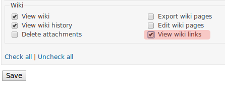
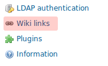

Redmine Wiki Backlinks plugin
=============================

This a plugin for the [Redmine](http://www.redmine.org) project management tool. The plugin extends the standard Redmine wiki sidebar with these reports about internal wiki links:

* For each page, all the links from it (*forward links*).
* For each page, all the links to it (*backward links* or *backlinks*).
* For each wiki, all the pages that are not the target of any link (*orphan pages*).
* For each wiki, all the link targets that do not exist yet (*wanted pages*).

The plugin has been tested with Redmine 2.4, but it should work with Redmine 2.2+, as it is based on the facilities provided by Rails 3.2.

The plugin is available under the terms of the [GNU General Public License](http://www.gnu.org/licenses/gpl-2.0.html), version 2 or later.

Installation
------------

Installing the plugin requires cloning this Git repository inside the `plugins` directory of the Redmine installation and migrating the production database:

    cd plugins
    git clone git://github.com/bluezio/redmine_wiki_backlinks.git
    cd ..
    rake redmine:plugins:migrate RAILS_ENV=production

After running these commands, Redmine must be restarted.

First-time operation
--------------------

By default, nobody can view the reports. In order to see these new links, the user must have a role with the new "View wiki links" permission, which is part of the "Wiki" permission group (highlighted below)":

The plugin automatically detects changes on the wiki, but it does not parse the existing contents unless instructed to do so. This can be done from the new "Wiki links" menu inside the "Administration" page:

This menu entry will list all the projects that have a wiki:

By checking their entries and clicking on the "Parse" button, all pages in the wiki will be parsed looking for links. This should only be done right after installing the plugin: all subsequent changes on the wiki will be automatically picked up by the plugin.

Daily operation
---------------

After enabling the permission on the relevant roles and parsing in bulk the existing content, this plugin should not require any further administration: all changes on the wikis should be picked up automatically.

Note that this plugin focuses on internal wiki links between pages of the same wiki: inter-project wiki links are *not* handled by this plugin. This is by design, due to efficiency concerns.

Enjoy!
